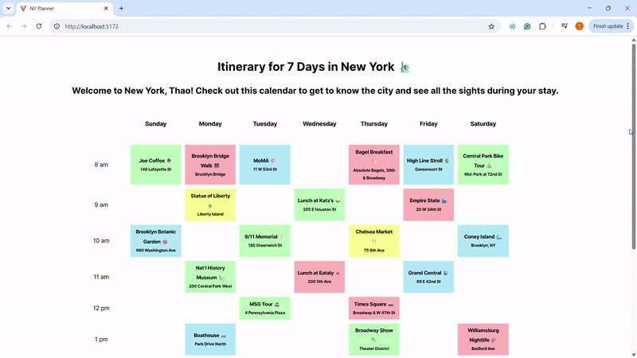

# Traveling Week Planner

A React app to plan a full week (Sun–Sat, 8 am–5 pm) in an 8×10 grid. Each hour slot is a reusable `<Event>` component showing a title, location, and color.

### Features
- 7 × 10 timetable grid  
- `<Event>` props: `event`, `location`, `color`
- Color-coded backgrounds  
- Configurable times and gutter spacing via CSS
### Demo


### Quick Start
```bash
git clone https://github.com/npthao110/WEB102-Lab1.git
cd WEB102-Lab1
npm install
npm run dev      
# then open localhost in your browser
